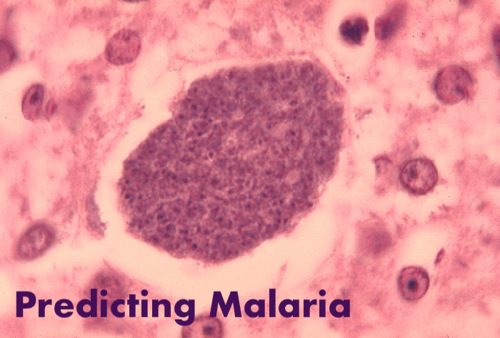

# Predicting Malaria in Blood Cells
**Author:** [Jonathan Fetterolf](mailto:jonathan.fetterolf@gmail.com)

[Malaria Prediction Web Application](https://fetterollie-ma-applicationmalaria-prediction-application-dc1w0r.streamlit.app/)

[Presentation Slides](https://github.com/fetterollie/Malaria-Data-Exploration/blob/880b23a1f814036f44a30f779c4828f46d2ff321/predicting_malaria_slides.pdfef)
## Business Understanding
According to the latest [World Malaria Report](https://www.who.int/publications/i/item/9789240064898) published by the [World Health Organization](https://www.who.int/news-room/fact-sheets/detail/malaria), there were 247 million cases of malaria in 2021 compared to 245 million cases in 2020. The estimated number of malaria deaths stood at 619,000 in 2021 compared to 625,000 in 2020. An early diagnosis and subsequently early treatment of malaria will help doctors practicing in areas with high rates of malaria infection and malaria deaths. Four African countries accounted for over half of all malaria deaths worldwide: Nigeria (31.3%), the Democratic Republic of the Congo (12.6%), United Republic of Tanzania (4.1%) and Niger (3.9%). 

### Business Problem
The [WHO | Regional Office for Africa](https://www.afro.who.int/health-topics/malaria) recognizes that malaria is going undiagnosed and subsequently untreated in areas where the parasite is prevalent and the resources to diagnose and treat it are the lowest. The WHO wants to create a model that can accurately predict whether or not a cell from stained blood smear is infected with malaria in order to more effectively diagnose and treat malaria in the population. 

This application can save lives. According to the [CDC](https://www.cdc.gov/malaria/diagnosis_treatment/clinicians1.html#:~:text=The%20preferred%20antimalarial%20for%20interim,not%20adequate%20for%20interim%20treatment.): in an ideal situation malaria treatment should not be initiated until the diagnosis has been established by laboratory testing. “Presumptive treatment”, i.e., without prior laboratory confirmation, should be reserved for extreme circumstances, such as strong clinical suspicion of severe disease in a setting where prompt laboratory diagnosis is not available. Doctors will still be needed to take blood and provide treatments. Histologists will still be required to prepare slides and confirm the diagnoses. This technology will simply make their operations more effiecient and allow them to dianose and treat more patients.

### Diagnosis
Malaria parasites can be identified by examining under the microscope a drop of the patient’s blood, spread out as a “blood smear” on a microscope slide. Prior to examination, the specimen is stained (most often with the Giemsa stain) to give the parasites a distinctive appearance. This technique remains the gold standard for laboratory confirmation of malaria. However, it depends on the quality of the reagents, of the microscope, and on the experience of the laboratorian.

In the case of identifying cells parasitized by malaria, the Giemsa stain is particularly useful because the stain binds to the parasite's chromatin and makes it stand out under a microscope.

### Cost of Errors
 The [CDC](https://www.cdc.gov/malaria/diagnosis_treatment/diagnosis.html) states that Malaria must be recognized promptly in order to treat the patient in time and to prevent further spread of infection in the community via local mosquitoes. Malaria should be considered a potential medical emergency and should be treated accordingly. *Delay in diagnosis and treatment is a leading cause of death in malaria patients in the United States*.

When considering the diagnosis of malaria, false negatives are more costly than false positives for a few reasons: 
- Treatment is relatively cheap ([USD $3-6](https://www.ncbi.nlm.nih.gov/pmc/articles/PMC3844618/) as of 2013)
- Side effects are minimal
- Undiagnosed malaria can lead community transmission and eventually to death

Recall will be a very important metric when evaluating the models as the goal is minimizing false negatives.

## Exploring Data
The data originally comes from the [National Institute of Health's National Library of Medicine](https://lhncbc.nlm.nih.gov/) (NLM - NIH). It can be found at [TensorFlow](https://www.tensorflow.org/datasets/catalog/malaria) or [Kaggle](https://www.tensorflow.org/datasets/catalog/malaria). The data consists of 27,558 cell images with equal instances of parasitized and uninfected cells from the thin blood smear slide images of segmented cells. Having equal samples is important in the training of this model to avoid class bias in predictions generated by the model. 

Note: I have constructed smaller datasets to require less processing power while running the notebook. These datasets also have equal instances of parasitized and uninfected cells.

I have also brought in auxiliary data that *is not* used in the modeling process. It's used to generate statistics and visualizations about malaria cases and deaths from around the world. This data is provided by the WHO and can be found in the following places: 
- [Estimated Cases](https://www.who.int/data/gho/data/indicators/indicator-details/GHO/estimated-number-of-malaria-cases)
- [Estimated Deaths](https://www.who.int/data/gho/data/indicators/indicator-details/GHO/estimated-number-of-malaria-deaths)
- [Confirmed Cases](https://www.who.int/data/gho/data/indicators/indicator-details/GHO/number-confirmed-malaria-cases)

## Data Preprocesses & Augmentation
Resizing images normalizes the input sizes which will regularize the training process while rescaling images helps the CNN to learn more effectively. 

Using this data augmentation will help avoid overfitting by creating unseen training examples from the existing ones, thereby increasing the size of the training dataset.

## Baseline Model
The data I use for this problem is evenly balanced. A baseline model, choosing all cells to 'Uninfected' results in an accuracy of 50%. 

## Convolutional Neural Network
I decided to build and train a Convolutional Neural Network (CNN) for this problem because it effectively learns from spatial features in images such as edges, corners, and textures. The CNN classifies the images based on these features and is typically very successful in image classification problems like this. 

### Model 1
Parameters
- Optimizer: `adam`
- Loss: `binary crossentropy`
- Metrics: `accuracy`, `false negatives`
- Total params: `6,479,873`
- Trainable params: `6,479,873`
- Non-trainable params: `0`

### Model 2
This model has the same structure but adds in a data augmentation layer which will peform a random flip and random rotation on the image. 

Parameters
- Optimizer: `adam`
- Loss: binary `crossentropy`
- Metrics: `accuracy`, `false negatives`
- Total params: `6,479,873`
- Trainable params: `6,479,873`
- Non-trainable params: `0`

### Model 3
Parameters
- Optimizer: `adam`
- Loss: binary `crossentropy`
- Metrics: `accuracy`, `false negatives`
- Total params: `6,747,265`
- Trainable params: `6,744,897`
- Non-trainable params: `2,368`

### Model 4
Parameters
- Optimizer: `adam`
- Loss: binary `crossentropy`
- Metrics: `accuracy`, `false negatives`
- Total params: `1,246,305`
- Trainable params: `1,246,305`
- Non-trainable params: `0`

### Model 5
Back to structure of Model 2 but increasing number of epochs.
### Compile
Parameters
- optimizer: `adam`
- loss: binary `crossentropy`
- metrics: `accuracy`, `false negatives`
- Total params: `6,479,873`
- Trainable params: `6,479,873`
- Non-trainable params: `0`

### Model 6
Parameters 
- optimizer: `adam`
- loss: `binary crossentropy`
- metrics: `accuracy`, `false negatives`
- Total params: `67,373,441`
- Trainable params: `67,373,441`
- Non-trainable params: `0`

## Final Model
Using structure from Model 2, training on over 19,000 images. Validated with 5,500 images.

Parameters
- optimizer: `adam`
- loss: binary `crossentropy`
- metrics: `accuracy`, `false negatives`
- Total params: `6,479,873`
- Trainable params: `6,479,873`
- Non-trainable params: `0`

### Results
Tested with 2,700 unseen images with results of: 
- Accuracy:0.9655172228813171
- Precision:0.9766213893890381
- Recall:0.9536082744598389

## Futher Exploration / Next Steps
- I would like to collect more data and retrain the model.
- Create a new feature for the application.
This will allow the user to submit an image of an entire blood smear with many blood cells, split that image into separate images of individual cells that can be used as input to the model.
- The model will now be able to deliver estimated parasitic burden which is used by clinicians to make decisions regarding treatment for malaria cases.

## Conclusion
This new tool will rapidly and accurately diagnose potential cases of Malaria, estimate parasitic burden, and will allow for the early treatment of more malaria cases, greatly reducing community transmission and saving lives around the world.

